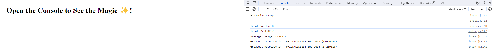

# Hansal's Console Finances

## Description

This project is to showcase my javascript knowledge we learnt in class by being tasked with creating code for analyzing the financial records of a company. I have been provided with a financial dataset in the javascript file.
The instructions to make this are being taken directly from EdX FE Bootcamp fourth challenge's description. Please view the credits section to review the sources I used in this project.

## Instructions

Task is to write JavaScript code that analyzes the records to calculate each of the following:

* The total number of months included in the dataset.

* The net total amount of Profit/Losses over the entire period.

* The average of the changes in Profit/Losses over the entire period.

    * You will need to track what the total change in profits is from month to month and then find the average.

    * (Total/(Number of months - 1))

* The greatest increase in profits (date and amount) over the entire period.

* The greatest decrease in losses (date and amount) over the entire period.

## Link to published site
https://09hanvaik.github.io/Console-Finances/

## Screenshot of site

## Installation

No installation steps required.

## Credits

I have used the following sites in my project as either and inspiration or to overcome a hurdle:
* Skills for Life/EdX FE bootcamp course 2023/24.
* Javascript documentation: https://developer.mozilla.org/en-US/docs/Web/JavaScript/
* How to remove first value: https://sentry.io/answers/remove-specific-item-from-array/
